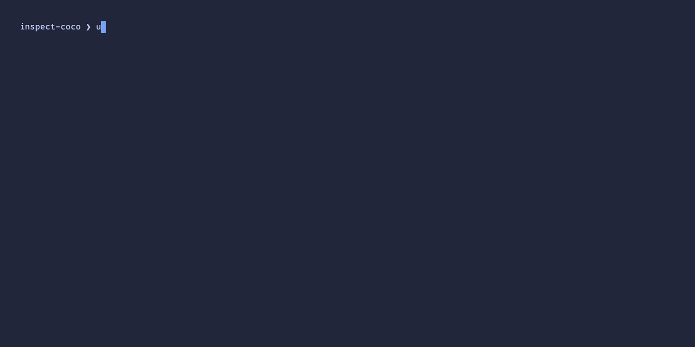
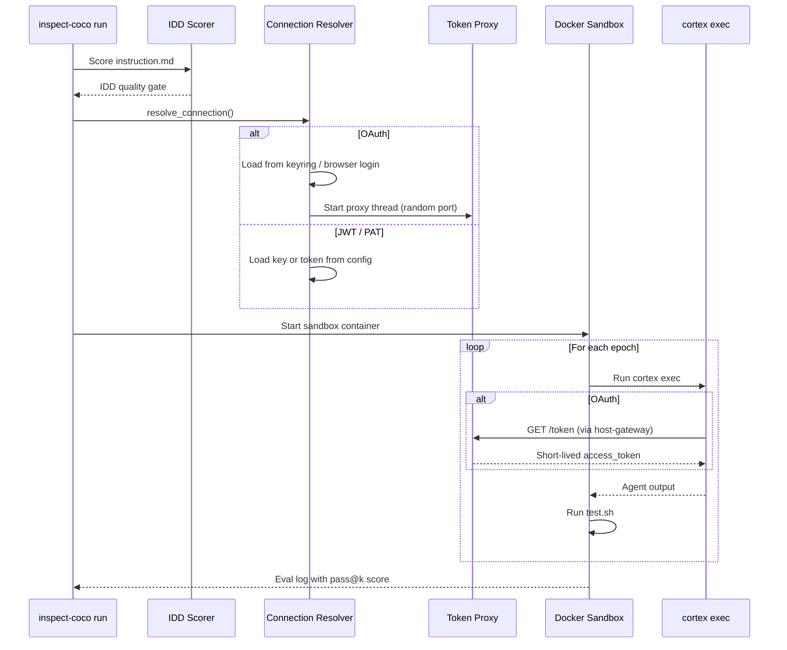

# Inspect CoCo

[](https://kameshsampath.github.io/inspect-coco/)
[](LICENSE)
[](https://ghcr.io/kameshsampath/inspect-coco-sandbox)

**AI agents are non-deterministic. The same prompt produces different
results every run. inspect-coco measures whether yours works reliably.**

Write an instruction, write a test script, run it N times, get a
consistency score. No LLM-as-judge variance. Exit 0 means pass.

```bash
git clone https://github.com/kameshsampath/inspect-coco.git && cd inspect-coco
task quickstart
```

Expected output:

```
             hello-world
┏━━━━━━━━┳━━━━━━━━┳━━━━━━━┳━━━━━━━━━━━━━━━━┓
┃  Epoch ┃ Result ┃ Score ┃            IDD ┃
┡━━━━━━━━╇━━━━━━━━╇━━━━━━━╇━━━━━━━━━━━━━━━━┩
│      1 │  PASS  │  1.00 │           1.00 │
│      2 │  PASS  │  1.00 │           1.00 │
│      3 │  FAIL  │  0.00 │           1.00 │
├────────┼────────┼───────┼────────────────┤
│ pass@3 │  2/3   │  0.67 │ variance=0.222 │
└────────┴────────┴───────┴────────────────┘
```

> [!NOTE]
> - Early development. The API may change. Not yet published to PyPI.
> - Requires [Cortex Code](https://docs.snowflake.com/en/user-guide/cortex-code/cortex-code)
>   beta channel (`cortex exec --help` to verify).

## See what's inside

An eval is three files. Here's the included `examples/hello-world/`:

**instruction.md** (what the agent should do):

```markdown
## Goal
Create a file `/workspace/hello.txt` containing exactly "Hello, World!".

## Requirements
- The file must be at `/workspace/hello.txt`
- Content must be exactly "Hello, World!" with no trailing newline

## Constraints
- Do not create any other files
- Do not install any packages

## Output
- File `/workspace/hello.txt` exists
- Content is exactly "Hello, World!" (verified by test script)
```

**tests/test.sh** (how you verify it):

```bash
#!/bin/bash
set -e

if [ ! -f /workspace/hello.txt ]; then
    echo "FAIL: /workspace/hello.txt does not exist"
    exit 1
fi

CONTENT=$(cat /workspace/hello.txt)
if [ "$CONTENT" != "Hello, World!" ]; then
    echo "FAIL: Content mismatch. Got: '$CONTENT'"
    exit 1
fi

echo "PASS"
```

**task.toml** (configuration):

```toml
version = "1.0"

[metadata]
name = "hello-world"
description = "Simple file creation eval"
epochs = 3
idd_threshold = 0.6

[agent]
timeout_sec = 300
max_turns = 10
```

That's it. No framework boilerplate, no scoring rubrics to calibrate,
no API keys for an eval platform. The test script is a bash file you
already know how to write.

## What happens when you run it

1. **IDD pre-check** scores your instruction quality. Vague instructions
   get flagged before burning Docker compute.
2. **Docker sandbox** starts with your Snowflake credentials deployed
   securely (OAuth tokens stay in your OS keychain, never enter Docker).
3. **`cortex exec`** runs inside the container with your instruction.
4. **`test.sh`** verifies the result. Binary pass/fail.
5. **Repeat N epochs.** pass@k tells you whether the skill works
   consistently, not just once.



## Prerequisites

- Python 3.12+
- Docker 20.10+ running
- [Task](https://taskfile.dev/) runner (`brew install go-task` / `go install github.com/go-task/task/v3/cmd/task@latest`)
- [Cortex Code CLI](https://docs.snowflake.com/en/user-guide/cortex-code/cortex-code)
  (beta channel)
- `~/.snowflake/connections.toml` with a supported authenticator:

| Authenticator | Best for | Notes |
|--------------|----------|-------|
| `OAUTH_AUTHORIZATION_CODE` | Local dev (recommended) | Browser login, keychain storage, no secrets in Docker |
| `SNOWFLAKE_JWT` | CI / automation | Key-pair auth, key deployed into sandbox |
| `PROGRAMMATIC_ACCESS_TOKEN` | CI / automation | Long-lived token deployed into sandbox |

See [Security Model](docs/security.md) for details on credential handling.

## Install

```bash
# As a Python package (for use in other projects)
pip install git+https://github.com/kameshsampath/inspect-coco.git

# Or as a CoCo plugin (inside Cortex Code, works from any directory)
cortex plugin https://github.com/kameshsampath/inspect-coco
```

## Usage

> [!IMPORTANT]
> All `task` commands must be run from the cloned repo root.
> CoCo plugin skills (`$inspect-coco:scaffold`, `$inspect-coco:create-task`)
> work from any directory.

### Quick commands

```bash
# Generate eval tasks from your CoCo plugin structure
task eval:scaffold
task eval:scaffold -- --dry-run   # preview without writing

# Score instruction quality (no Docker needed)
task eval:idd

# Run a single task (3 epochs)
task eval:run -- examples/hello-world --epochs=3

# Run all examples
task eval:run

# View results in browser
task eval:view
```

Run `task --list` to see all available commands.

### As a CoCo plugin

Once installed, invoke skills directly from Cortex Code for interactive
guidance, IDD template generation, and context-aware scaffolding.

| Skill | What it does |
|-------|-------------|
| `$inspect-coco:scaffold` | Scan plugin structure, generate eval suites per leaf skill |
| `$inspect-coco:create-task` | Guided single-task creation with IDD structure |

### CLI reference

| Command | What it does |
|---------|-------------|
| `inspect-coco scaffold` | Generate eval suites from plugin structure |
| `inspect-coco run <path>` | Execute eval suite(s) or a single task |
| `inspect-coco idd-check <path>` | Score instruction quality without running evals |

See [docs/cli.md](docs/cli.md) for the full command reference.

## Writing your own evals

The instruction follows a four-section format (IDD) that constrains agent
behavior and makes scoring binary:

```markdown
## Goal
Create a Python REST API with a /health endpoint.

## Requirements
- Use FastAPI
- Return {"status": "ok"} on GET /health
- Include a Dockerfile that builds and runs the app

## Constraints
- No external databases
- Single-file implementation (main.py)
- Port 8080

## Output
- main.py exists and is valid Python
- Dockerfile builds without errors
- GET localhost:8080/health returns {"status": "ok"}
```

Why this works: a clear Goal fixes the target, Requirements declare intent
(not steps), Constraints close divergent paths, and Output criteria make
scoring binary. The agent has less room to wander, so pass@k goes up.

See [docs/writing-evals.md](docs/writing-evals.md) for the full guide.

## Scaffold from existing skills

If you already have a CoCo plugin:

```bash
task eval:scaffold -- --dry-run   # preview what would be generated
task eval:scaffold                # generate eval tasks per leaf skill
```

This reads `.cortex-plugin/plugin.json`, detects leaf skills (skips
routers), and generates IDD-structured eval tasks for each one.

## How it works (architecture)



## Why Inspect AI?

Agent evaluation is not prompt scoring. It requires running untrusted code
in containers, verifying filesystem/database state, and measuring
consistency across repeated runs. Most eval frameworks (Promptfoo, DeepEval,
Braintrust, LangSmith) assume text-in/text-out and lack sandboxed execution
as a first-class primitive.

[Inspect AI](https://inspect.aisi.org.uk/) provides this out of the box:
Docker sandbox orchestration, epoch/pass@k execution, a plugin architecture
(`@task`/`@agent`/`@scorer`), structured eval logs, and the `inspect view`
web UI. inspect-coco adds the CoCo-specific layer: IDD pre-scoring as a
quality gate, the `cortex exec` agent wrapper, secure credential deployment
(OAuth token proxy, JWT, PAT), and deterministic test-script verification.

See [docs/why-inspect-ai.md](docs/why-inspect-ai.md) for the full
comparison and rationale.

## Build locally

```bash
git clone https://github.com/kameshsampath/inspect-coco.git && cd inspect-coco
task install          # uv sync with dev + docs groups
task check            # lint + typecheck + tests
task eval:dry-run     # verify eval setup without Docker
```

## Project structure

```
src/inspect_coco/
  cmd/              # CLI commands (run, idd-check, scaffold)
  agents/           # CoCo agent (cortex exec wrapper)
  config/           # Connection resolution and credential deployment
  idd/              # IDD scoring and explainer
  scaffold.py       # Eval suite generation from plugin structure
  suite.py          # suite.yaml loader
  tasks/            # Task loader (task.toml + instruction.md)
  scorers/          # Deterministic test-based scoring
  trajectory/       # cortex exec output parser
  sandbox/          # Dockerfile and default compose.yaml
```

## Documentation

- [Why Inspect AI?](docs/why-inspect-ai.md)
- [Getting Started](docs/getting-started.md)
- [CLI Reference](docs/cli.md)
- [Task Configuration](docs/task-toml.md)
- [Suite Configuration](docs/suite-yaml.md)
- [IDD Scoring](docs/idd-scoring.md)
- [Writing Evals](docs/writing-evals.md)
- [Architecture](docs/architecture.md)
- [Security Model](docs/security.md)

## External references

- [Inspect AI documentation](https://inspect.aisi.org.uk/)
- [Intent-Driven Development: The Shift Developers Can't Ignore](https://blogs.kameshs.dev/intent-driven-development-the-shift-developers-cant-ignore-ef434f94d56c)
- [Intent Compression Ratio: Measuring the Power of Intent](https://blogs.kameshs.dev/intent-compression-ratio-measuring-the-power-of-intent-ceb6faf2e2f9)
- [ICR and Token Economics](https://blogs.kameshs.dev/icr-and-token-economics-9a014a75b399)

## License

Apache-2.0. See [LICENSE](LICENSE) for details.

## Citation

If you use inspect-coco in your research or publications:

```bibtex
@software{inspect_coco,
  author = {Sampath, Kamesh},
  title = {inspect-coco: Deterministic Evaluations for Cortex Code Skills},
  url = {https://github.com/kameshsampath/inspect-coco},
  license = {Apache-2.0}
}
```
