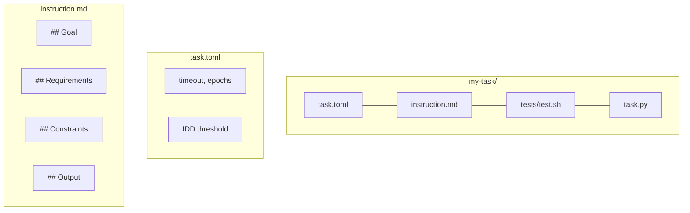

# inspect-coco

Deterministic evaluations for
[Cortex Code](https://docs.snowflake.com/en/user-guide/cortex-code/cortex-code)
(CoCo) skills using [Inspect AI](https://inspect.aisi.org.uk/).

- **Scaffold** eval suites from existing CoCo plugins in one command
- **Score** instruction quality with IDD (Intent-Driven Development) analysis
- **Measure** consistency via pass@k (repeated runs with epochs)

## Quickstart

### Prerequisites

- Python 3.12+
- Docker running
- `~/.snowflake/connections.toml` with a JWT or PAT connection
- Cortex CLI (beta channel): `cortex exec --help` should work

### Install

```bash
uv add git+https://github.com/kameshsampath/inspect-coco.git
```

### Configure

```bash
cp .env.example .env
# Set INSPECT_COCO_SNOWFLAKE_CONNECTION to your connection
# (run: grep "^\[" ~/.snowflake/connections.toml to see options)
```

### Run your first eval

The primary way to use inspect-coco is as a **CoCo plugin** from within
Cortex Code:

```text
# Scaffold evals from your plugin's skills
$inspect-coco:scaffold

# Create a single eval task with guided IDD prompts
$inspect-coco:create-task
```

You can also use the CLI for scripting and CI:

```bash
# Check instruction quality (no Docker needed)
inspect-coco idd-check examples/

# Run an eval (requires Docker + Snowflake connection)
inspect-coco run examples/hello-world

# View results
inspect view
```

## Usage

### As a CoCo Plugin (recommended)

Install the plugin in your project and invoke skills directly from
Cortex Code. This gives you interactive guidance, IDD template
generation, and context-aware scaffolding.

| Skill | What it does |
|-------|-------------|
| `$inspect-coco:scaffold` | Scan plugin, generate eval suites per skill |
| `$inspect-coco:create-task` | Guided single-task creation with IDD structure |

### As a CLI

The CLI provides the same functionality for scripts, CI pipelines,
and terminal workflows.

| Command | What it does |
|---------|-------------|
| `inspect-coco scaffold` | Generate eval suites from plugin structure |
| `inspect-coco run <path>` | Execute eval suite(s) or a single task |
| `inspect-coco idd-check <path>` | Score instruction quality (no eval run) |

See [docs/cli.md](docs/cli.md) for full reference.

## How It Works

```mermaid
flowchart LR
    A[instruction.md] --> B{IDD Scoring}
    B -->|pass| C[Docker Sandbox]
    B -->|warn/fail| D[Feedback]
    C --> E[cortex exec]
    E --> F[test.sh]
    F --> G{Score}
    G -->|repeat N epochs| C
    G --> H[pass@k metric]
```

1. **IDD pre-check** -- scores your instruction for
   Goal/Requirements/Constraints/Output
2. **Sandbox execution** -- runs `cortex exec` inside Docker with your
   Snowflake credentials
3. **Deterministic scoring** -- `test.sh` (or pytest) verifies the
   output; exit 0 = pass
4. **Consistency** -- repeats across epochs for a pass@k reliability
   metric

## Writing Evals

Each eval task is a directory:



Group tasks into suites with `suite.yaml` for shared defaults.
See [docs/writing-evals.md](docs/writing-evals.md) for details.

## Scaffold from Existing Skills

If you have a CoCo plugin with skills:

```text
# From within Cortex Code (recommended)
$inspect-coco:scaffold
```

```bash
# Or via CLI
inspect-coco scaffold --dry-run   # preview
inspect-coco scaffold             # generate
```

This reads `.cortex-plugin/plugin.json`, detects leaf skills (skips routers),
and generates IDD-structured eval tasks per skill.

## Project Structure

```
src/inspect_coco/
  cmd/              # CLI commands (run, idd-check, scaffold)
  agents/           # CoCo agent (cortex exec wrapper)
  config/           # Connection resolution + credential deployment
  idd/              # IDD scoring + explainer
  scaffold.py       # Eval suite generation from plugin structure
  suite.py          # suite.yaml loader
  tasks/            # Task loader (task.toml + instruction.md)
  scorers/          # Deterministic test-based scoring
  trajectory/       # cortex exec output parser
  sandbox/          # Dockerfile + default compose.yaml
```

## Documentation

- [Getting Started](docs/getting-started.md)
- [CLI Reference](docs/cli.md)
- [Task Configuration](docs/task-toml.md)
- [Suite Configuration](docs/suite-yaml.md)
- [IDD Scoring](docs/idd-scoring.md)
- [Writing Evals](docs/writing-evals.md)
- [Architecture](docs/architecture.md)

## Status

Early development. API may change. Not yet on PyPI.

## License

Apache-2.0
