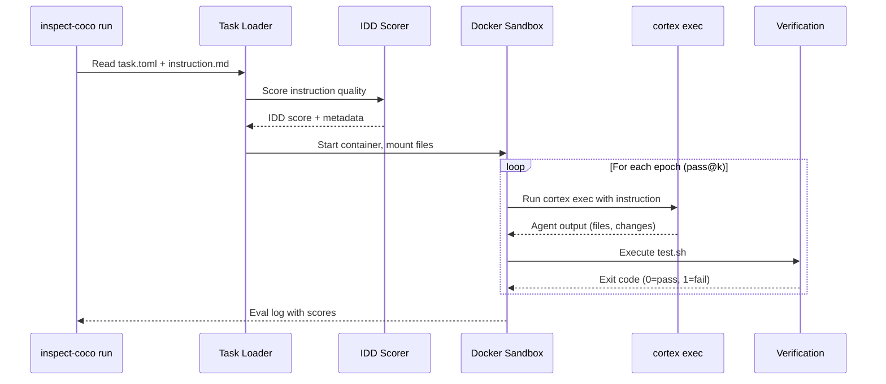
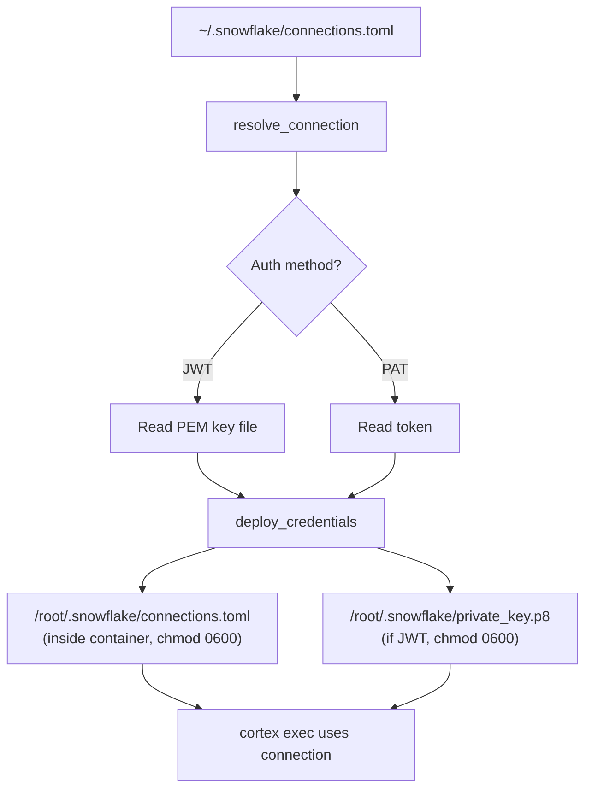
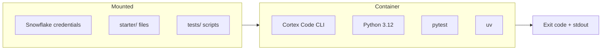
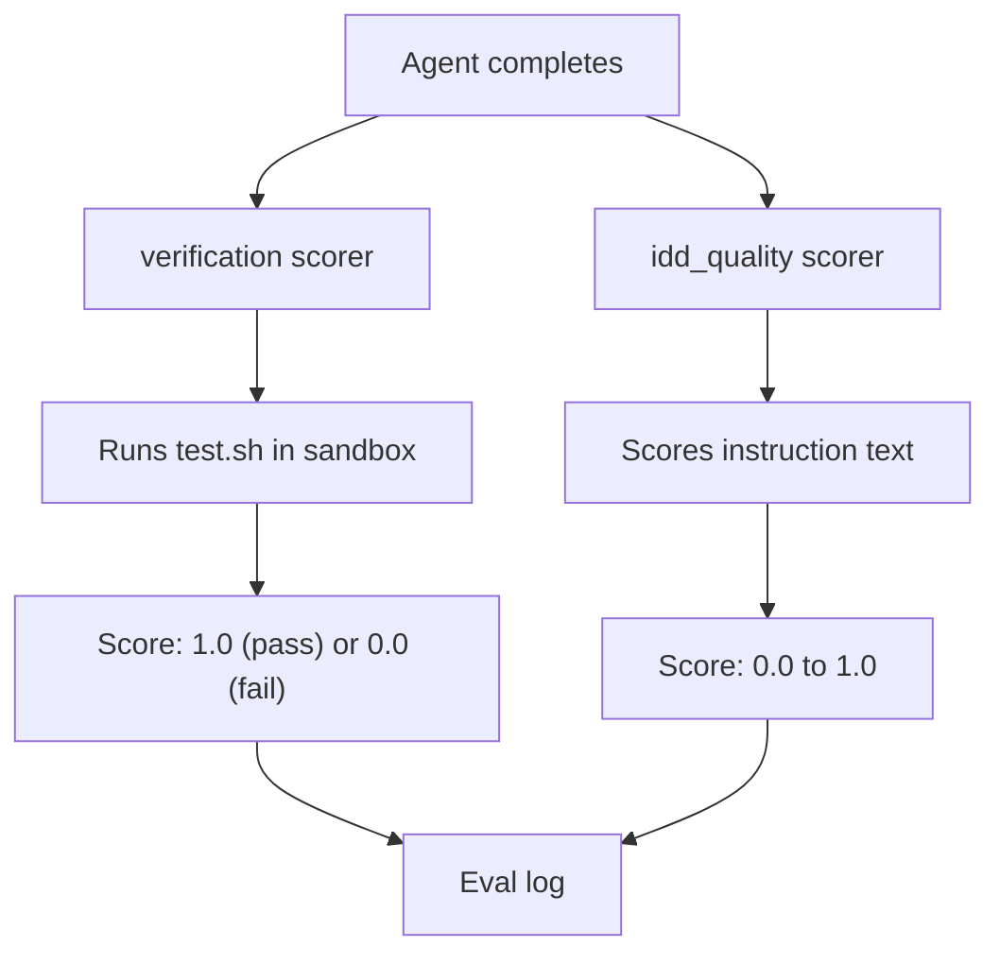
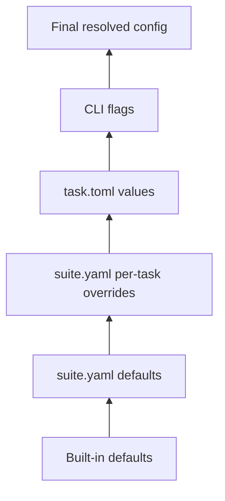

# Architecture

This page describes how inspect-coco works internally and how the pieces fit together.

## Execution flow

When you run `inspect-coco run`, the following sequence occurs:

## Credential flow

The agent needs Snowflake credentials to call the Cortex API. These never leave the host filesystem unencrypted.

!!! note "Connection resolution"

    The resolver checks `INSPECT_COCO_SNOWFLAKE_CONNECTION` first, then falls back to a connection named `default` in your TOML file. Run `snow connection list` to see available connections.

## Sandbox environment

Each eval runs inside an isolated Docker container built from `src/inspect_coco/sandbox/Dockerfile`:

The container includes:

- **Python 3.12** as the base runtime
- **Cortex Code CLI** (beta channel by default, controlled via `CORTEX_CHANNEL` build arg)
- **pytest** for running test suites
- **uv** for package management inside the sandbox

## Scoring pipeline

Two scorers run after the agent completes:

The **verification** scorer produces `passed` and `total` metrics (how many epochs passed out of how many ran). The **idd_quality** scorer produces an `idd_score` metric (instruction quality rating).

## Configuration merge order

When multiple configuration sources exist, they merge with this priority:

The highest priority source wins for each setting. CLI flags always override everything else.
