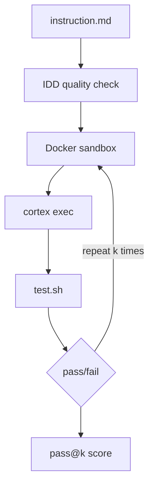

# Inspect CoCo

**AI agents are non-deterministic. Test whether yours works reliably.**

inspect-coco runs your agent against structured instructions inside
isolated Docker containers, verifies output with deterministic tests,
and repeats the process to surface flaky behavior.

The core question it answers: *does this skill do the right thing every time?*

## How it works



1. Your **instruction** describes what the agent should accomplish, structured with Goal, Requirements, Constraints, and Output sections.
2. The **IDD scorer** checks instruction quality before running anything expensive.
3. A **Docker sandbox** provides a clean, isolated environment for each run.
4. The **CoCo agent** executes the instruction via `cortex exec`.
5. A **verification script** checks whether the agent produced the correct result.
6. **Epochs** repeat the process multiple times to measure consistency.

## Why Inspect AI?

Agent evaluation requires sandboxed code execution, not text scoring. See
[Why Inspect AI?](why-inspect-ai.md) for the full rationale and comparison
with Promptfoo, DeepEval, Braintrust, LangSmith, and Eleuther.

## Why structured instructions matter

Vague instructions produce inconsistent results. When you tell an agent to
"set up the project properly," each run takes a different path. Structured
instructions (IDD format) narrow the solution space so the agent converges
on the same correct behavior across runs.

This is the hypothesis inspect-coco validates: **high instruction quality
predicts high pass@k consistency.**

## Quick start

```bash
git clone https://github.com/kameshsampath/inspect-coco.git && cd inspect-coco
task quickstart
```

This installs dependencies, runs the `hello-world` eval (3 epochs), and
opens the results viewer.

!!! tip "First time setup"

    See [Getting Started](getting-started.md) for prerequisites (Docker,
    Task, Cortex Code CLI, Snowflake connection) and a full walkthrough.

## What you get

- **Pass@k consistency scores** across repeated runs
- **IDD quality feedback** on your instructions before running expensive evals
- **Full transcripts** of every agent conversation (tool calls, responses, timing)
- **Scaffolding** that generates eval tasks from existing plugin structure
- **Zero SaaS dependencies** -- everything runs locally with Docker
