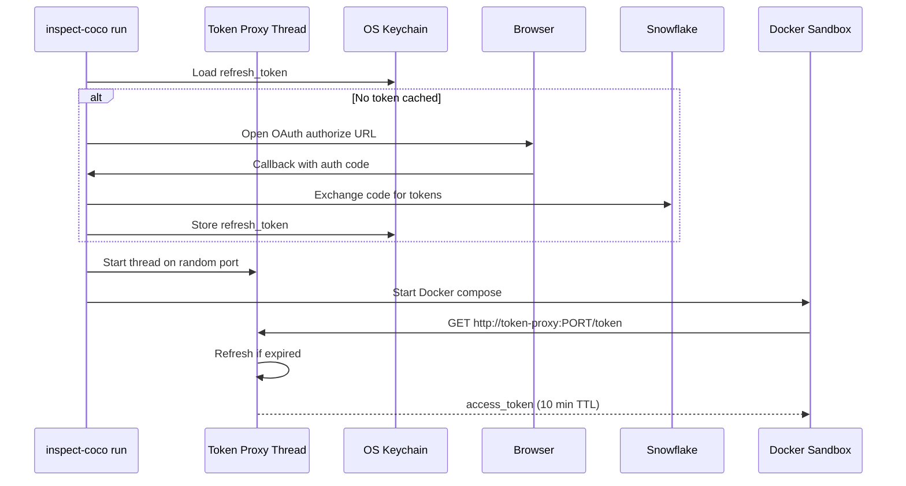
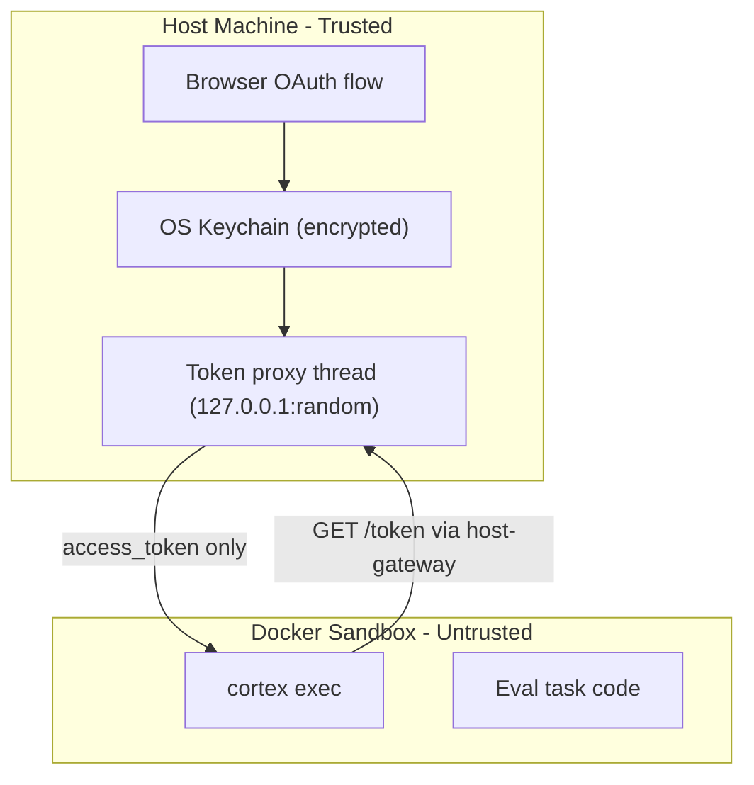

# Security Model

This page describes how inspect-coco handles authentication credentials and the security boundaries between the host, the token proxy, and the eval sandbox.

## Prerequisites

- **Docker 20.10+** required (for `host-gateway` support in `extra_hosts`)
- **macOS/Linux/Windows** with a keyring backend (Keychain, SecretService, or Windows Credential Locker)

## Authentication Methods

inspect-coco supports three authentication methods for connecting to Snowflake:

| Method | Config key | Secret type | Sandbox exposure |
|--------|-----------|-------------|-----------------|
| Key-pair (JWT) | `authenticator = "SNOWFLAKE_JWT"` | PEM private key | Key deployed into sandbox |
| Programmatic Access Token | `authenticator = "PROGRAMMATIC_ACCESS_TOKEN"` | Long-lived token | Token deployed into sandbox |
| Local OAuth | `authenticator = "OAUTH_AUTHORIZATION_CODE"` | Refresh token (host keyring only) | Short-lived access tokens only |

!!! tip "Recommended for untrusted evals"

    Use `OAUTH_AUTHORIZATION_CODE` when running evals against untrusted or
    third-party tasks. The sandbox never receives any long-lived credential.

## OAuth Token Proxy Architecture

When using `OAUTH_AUTHORIZATION_CODE`, inspect-coco uses a **host-process token proxy** that keeps all long-lived secrets on the host machine:



### How it works

1. **Connection resolution** detects `OAUTH_AUTHORIZATION_CODE` in your connections.toml
2. If no tokens are cached, your **browser opens automatically** for Snowflake login
3. The refresh token is stored in your **OS keychain** (encrypted at rest)
4. A lightweight **token proxy thread** starts on a random available port
5. The sandbox reaches the proxy via Docker's `host-gateway` mechanism
6. The sandbox only ever receives short-lived access tokens (~10 min TTL)
7. If the refresh token expires during a long eval run, the proxy **re-opens the browser** automatically

### Security boundaries



### What the sandbox can access

| Resource | Accessible? | Notes |
|----------|-------------|-------|
| Refresh token | No | Stored in host keychain, never enters Docker |
| Access token | Yes | Short-lived (~10 min), fetched via HTTP from host proxy |
| Token proxy endpoint | Yes | Via `host-gateway` on random port |
| Host filesystem | No | No volume mounts to sandbox |
| OS keychain | No | Requires host-level access |

### Random port assignment

The proxy binds to `127.0.0.1:0` (OS assigns a random available port). This:
- Eliminates port conflicts with other services
- Adds an obscurity layer (port must be discovered)
- The assigned port is passed to Docker via the `TOKEN_PROXY_PORT` env var

## Threat Model

| Threat | Risk | Mitigation |
|--------|------|-----------|
| Eval code reads long-lived credentials from sandbox | Eliminated | No secrets in Docker at all |
| Compromised eval code authenticates to Snowflake | Time-limited | Access token expires in ~10 minutes |
| Container escape to host | Low (kernel vuln) | Same risk as running Docker itself |
| Token proxy port scanning | Low | Bound to 127.0.0.1, random port, ephemeral |
| Refresh token theft | Eliminated from Docker | Stored in OS keychain, requires host-level access + login password |

## Keyring Storage

Tokens are stored in your OS keychain with the following structure:

| Keychain entry | Service name | Key | Value |
|---------------|-------------|-----|-------|
| Refresh token | `{account}.inspect-coco` | `refresh_token` | The refresh token string |
| Metadata | `{account}.inspect-coco` | `token_metadata` | JSON: access_token, expires_at, role |

On macOS, you can inspect these in **Keychain Access.app** (search for "inspect-coco").

### CI/Headless fallback

When no keyring backend is available (CI environments, headless servers), tokens fall back to a file at `~/.snowflake/inspect-coco-oauth.json` with 0600 permissions. A warning is logged when this fallback is used.

## Configuration

```toml title="~/.snowflake/connections.toml"
[default]
account = "myorg-myaccount"
user = "myuser"
authenticator = "OAUTH_AUTHORIZATION_CODE"
role = "SYSADMIN"
```

No additional setup needed. The browser flow triggers automatically on first use.

## SNOWFLAKE$LOCAL_APPLICATION Integration

The OAuth flow uses Snowflake's built-in `SNOWFLAKE$LOCAL_APPLICATION` security integration, which is designed for local development tooling. This integration:

- Issues refresh tokens (enabling silent token renewal without browser interaction)
- Uses the Authorization Code + PKCE flow (no client secret needed)
- Is pre-configured in Snowflake accounts (no admin setup required)

!!! note "Refresh token lifetime"

    The refresh token TTL is controlled by the integration configuration. For long-running eval suites, ensure the TTL exceeds your longest expected run time. Access tokens (~10 min) are refreshed silently using the refresh token — no browser interaction needed during the run.

For more details on Snowflake OAuth integrations, see the [official documentation](https://docs.snowflake.com/en/user-guide/oauth-snowflake-overview).
